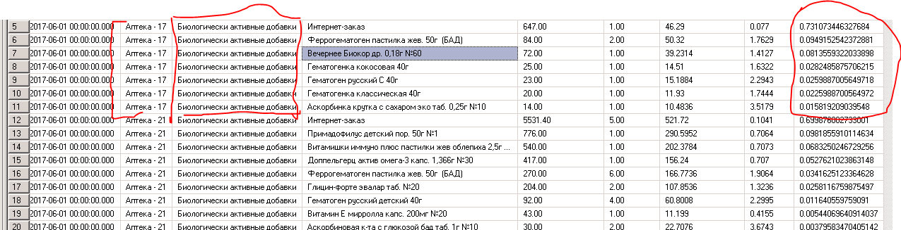

## Тестовое задание по SQL

	1. Заказчик утверждает, что продажи с НДС по сети, по группе товаров 'Биологически активные добавки',  в июне 2017 составил 1 782 949.10 руб. Продажи шт. - 6761.10.
        Необходимо найти и устранить возможные причины расхождений.
        Пример запуска процедуры: exec sp_report_1 @date_from = '2017-06-01', @date_to = '2017-06-30', @good_group_name = N'Биологически активные добавки'
	2. Необходимо добавить показатели: 
        -Средняя цена закупки руб., без НДС
        -Маржа руб. без НДС
        -Наценка % без НДС
	3. Добавить возможность фильтрации по нескольким группам товаров одновременно. На вход группы подаются через запятую в параметр @good_group_name.  
        Пример запуска процедуры: exec sp_report_1 @date_from = '2017-06-01', @date_to = '2017-06-30', @good_group_name = 'Биологически активные добавки,Косметические средства'
	4. Вывести долю продаж с НДС товара, в каждом дне/магазине/группе товаров, отсортировать выборку по убыванию показателя.
		Примечание. Относительно расчета - нужна доля от продаж позиции в аптеке, от продажи группы товара в этой же аптеке. Показатель нужно добавить в текущую процедуру формирования данных для отчета. 
	Пример расчета:


	
### Для разработчика 
	
	Если ты это читаешь значит ты наконец добрался до заданий по sql это задание выполненно не полностью так что если из комментариев не ясно то
	пиши в телегу. Что бы тебе не заморачиватся и не поднимать у себя MSSQL сервер установи на комп Docker https://www.docker.com/
	Еще из хороших новостей есть вот это https://dbdiffo.com/dbdiffo.php неплохой инструмент накидывать схемки (еще и в xml сохранить можно)
	В коммандах есть заккоментированные методы, их удали. Использовал их для эксперементов. В репозитории лежит исходник задания.
	Давно не возвращался к этому заданию как будет время (если ты меня не опередишь) то доделаю его.
	Задание было выдано при трудоустройстве на Data Engineer так что не ленись подними базу и прошерсти его.
	
	
```sql	
	USE [TestTaskDB]
	GO
	/****** Object:  StoredProcedure [dbo].[sp_report_1]    Script Date: 16.10.2021 20:44:23 ******/
	SET ANSI_NULLS ON
	GO
	SET QUOTED_IDENTIFIER ON
	GO

	ALTER PROCEDURE [dbo].[sp_report_1]
		@date_from date,
		@date_to date,
		@good_group_name nvarchar(MAX)
	AS
	BEGIN		
	declare @date_from_int int
	declare @date_to_int int
	declare @date_sum_salenet_int int /* правки */
	
	set @date_from_int = (select top 1 did from dbo.dim_date where d = @date_from )
	set @date_to_int = (select top 1 did from dbo.dim_date where d = @date_to )

		
	set @date_sum_salenet_int = (  /* это сумма продажи товара без ндс в выбраном промежутке, суммируются все аптеки */
		select sum(sale_net) 
		from [dbo].[fct_cheque] as f
			inner join dim_date as d
		on d.did = f.date_id
			inner join dim_goods as g
		on g.good_id = f.good_id
			inner join [dim_stores] as s
		on s.store_id = f.store_id
		where date_id between @date_from_int and @date_to_int)
		 

	SELECT d.d as [Дата],
		s.store_name as [Аптека],
		g.group_name as [Группа товара] ,
		g.good_name as [Номенклатура],
		sum(f.quantity) as [Продажи шт.],
		sum(f.sale_grs) as [Продажи руб., с НДС],	
				/* в задании оштбка была в этой строчке sum(f.sale_net) по факту продажи с ндс будет sum(f.sale_grs) если выполнить запрос по сумме продаж за июль то получим sale_net=1679529, sale_grs=1783203 */
		sum(f.cost_grs) as [Закупка руб., с НДС],												
				/* в задании оштбка была в этой строчке sum(f.cost_net) по факту продажи с ндс будет sum(f.cost_grs) */
		/*sum(f.sale_net * 100 / @date_sum_salenet_int ) as [Доля продаж товара %],  Доля продаж товара в % */
		sum(f.cost_net * 0.9) as [Закупка руб., без НДС],										
				/* Средняя цена закупки руб., без НДС (ндс 10%) */
		sum(f.sale_net - f.cost_net) as [Маржа руб.],											
				/* Разница между ценой и себестоимостью. В отличие от прибыли, маржа учитывает только производственные затраты,
				из которых складывается только себестоимость продукции*/
		sum(case when f.cost_net IS NULL OR f.cost_net != 0										
				/* так как в таблице присутствует товар стоимость которго указана как 0 рублей то делаем условие отсекающее такие результаты */
			then ((f.sale_net - f.cost_net) / f.cost_net) * 100 end) as [Наценка % без НДС]		
				/*"((продал - купил)/себестоимость)*100%"  - Наценка % без НДС */
	FROM [dbo].[fct_cheque] as f
	inner join dim_goods as g
		on g.good_id = f.good_id
	inner join [dim_stores] as s
		on s.store_id = f.store_id
	inner join dim_date as d
		on d.did = f.date_id
	inner join dbo.dim_cash_register as cr              
		on cr.cash_register_id = f.cash_register_id
	where date_id between @date_from_int and @date_to_int
		and g.group_name = @good_group_name
	group by d.d,
		s.store_name,
		g.group_name,
		g.good_name 
	/*order by d.d asc, s.store_name asc, [Доля продаж товара %] desc */ 

	END
```