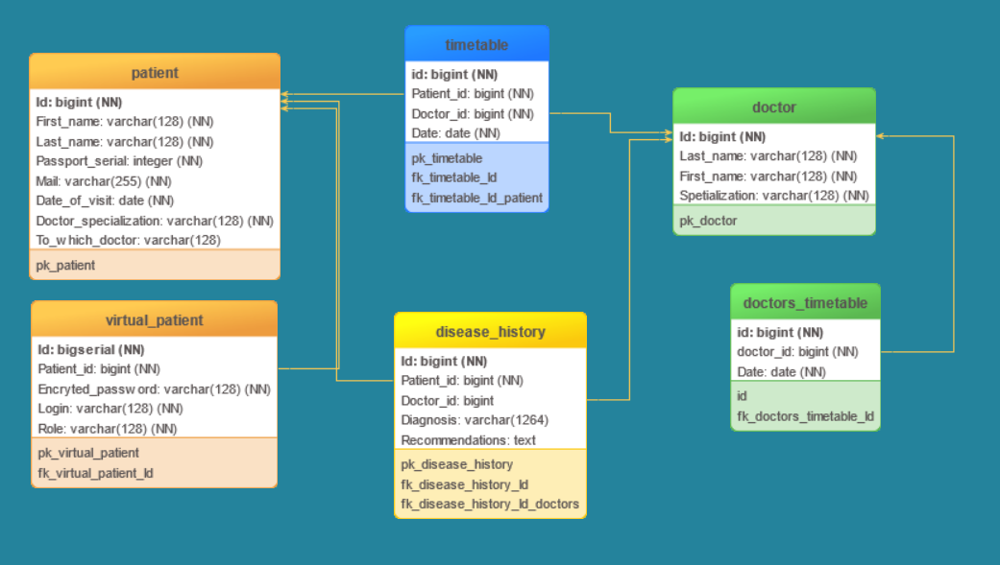
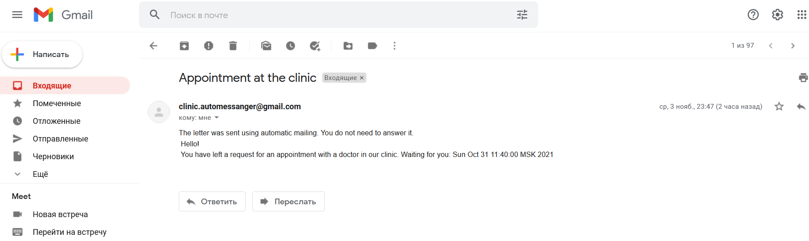
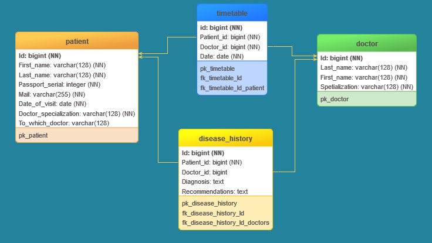

# Проект по созданию системы самозаписи в медицинскую клинику
_____________________________________________________________
### На данный момент можно вполнить запросы:
	http://localhost:8080/					-Возвращает страницу html страния является стартовой 
	http://localhost:8080/home				-Возвращает страницу html страния является стартовой 
	http://localhost:8080/login				-Возвращает страницу html с формой для входа в личный кабинет
	http://localhost:8080/doctorTimetable	-Возвращает страницу html с расписанием врачей
	http://localhost:8080/registration		-Возвращает страницу html регистрации на прием
	http://localhost:8080/patientList		-Возвращает страницу html со всеми зарезервированными датами (с указанием специализации)
	http://localhost:8080/patients			-Возвращает файл json в котором указанны все пациенты
	http://localhost:8080/patients/{id}		-Возвращает файл json в котором указан пациент с запрошенным id
	http://localhost:8080/doctors			-Возвращает страницу html в которой содержится таблица с имя/фамилия/специализация врачей

### 6. Added BCrypt
	На момент написания readme версия приложения 0.3.0
	
	В связи с внесением нового функционала были обновленны таблицы в бд.
	Добавленно шифрование паролей. В бд хранятся зашифрованные BCrypt -ом пароли.
	Порядок работы приложения:
		1. При запросе localhost/ вы попадаете на главную страницу. С данной страницы можно перейти к просмотру информации о докторах,
	просмотру расписания (к бд делается запрос на расписание в интервале текушего месяца), регистрация на прием. Так же можно перейти
	в личный кабинет.
		Много писать нет смысла, пройдемся по тому что может потребовать объяснений. В расписании дежурств врачей можно выбрать поиск
	по фамилии врача, поиск дежурящих врачей в конкретный день, поиск расписания дежурящих врачей на следующий месяц либо через месяц.
	Здесь внесу некоторое уточнение расписание дежурств у врачей в существующей действительности составляется на месяц вперед так что
	пологать существование расписания на два месяца вперед очень оптимистично. 
	С любой из страниц можно вернутся на главнию страницу.
		2. Запрос на регистрацию localhost:8080/registration открывается страница с формой для регистрации. Все поля кроме фамилии
	врача являются обязательными для заполнения. На данный момент проверка существует только в форме для регистрации.
	После заполнения всех обязательных полей отправляем форму. Данные будут формироватся из экземпляра PatientForm. В контроллере форма 
	разбирается на данные которые будут сохранятся в нужных сущностях а после в таблицах. 
	Первым делом проверим нету ли в репозитории записи на такое же время. 
	Проверяем еще два пренципиальных момента это указанная спецальность (не равна ли null) и указана ли дата приема.
	Проверяем что указал пациент в поле имя фамилия врача. Если поле заполнено оставляем как есть. Если поле пустое то делаем запрос к бд
	Какой врач указанной спецальности дежурит в указанный день. Если найден вписываем.
	Далее идут пять действий которые можно в принципе распоралелить...
	Создаем сущность Patient заполняем ее и сохраняем в бд.
	Создаем VirtualPatient. Такое страшное название обозначает что функционал данной сущности будет относится только к части взаимодействия
	с линым кабинетом рассположенным в приложении.
	Что бы заполнить сущность генерируем рандомные логин и пароль они будут отправлены по указанной пациентом почте. Прежде чем добавить 
	пароль в сущность шифруем его. Так же нужен id записи из таблицы Patient. В общем не придумолось ни чего лутше как генерировать рандом
	long через randomUUID(). Это обусловленно тем что делать лишний запрос к бд о том какой id сгенерирован не очень хочется, поэтому создаем
	рандом его и запрашиваем у экземпляра Patient. По умолчанию присваиваем роль PATIENT.
	Идем далее, существует таблица предназначенная для врачей и другого адменистративного персонала. Создаем экземпляр. Берем данные 
	из ранее полученной формы. Сохраняем в бд.
	Поскольку используем репозиторий в котором храним зарезервированное время то делаем запись и в него.
	Переходим к созданию письма в котором отправим дату/время приема, логин и пароль.
	Выводим страницу о том что на мейл отправлено письмо.
	
### 5. Added Spring security
	На момент написания readme версия приложения 0.2.1
	
	В проект добавленно Spring security, таблица для возможности создания личного кабинета пациента.
	Добавленно несколько страниц. Внесены небольшие доработки в стиль страниц.
	Изменен текст письма. На почту отправляются случайно сгенерированные логин и пароль.
	
	

### 4. Added serialization and mailing lists to the project 
	На момент написания readme версия приложения 0.1.9
	
	В проект добавлено: сериализация, ведение лога, отправка напоминания на почту.
	Сериализация.
	В проекте каждый раз при удачном добавлении новой записи (регистрации на прием) происходит сериализация класса PatientServiceImpl.
	Класс PatientServiceImpl в данный момент реализует три интерфеса PatientService, MaintenanceSerialization, Serializable. К нововведеням
	относится интерфейс MaintenanceSerialization который предназначен для определения дополнительных методов в классе PatientServiceImpl.
		loadRecording() - загрузка записей из ранее сериализованного файла, сначало проходит проверка не существует ли записей в HashSet
		если хоть одна запись существует то ни каих добавлений записей не произойдет
		getAllRecord() - получить из класса записи. Этот метод существует для того чтобы когда произойдет десериализация сохраненого 
		файла (./src/main/resources/config/saveFile.out) возможно было получить из него ранее сделанные записи.
	Так же класс Recording реализует интерфейс Serializable. При старте приложения происходит поиск файла saveFile.out в 
	папке  ./src/main/resources/config/ если файл отсутствует (ради эксперемента можите удалить этот файл) происходит дефолтовый сценарий
	при котором добавляются тестовые записи в репозиторий. В дальнейшем будет реализован поиск записей в бд и составление на этой основе
	HashSet с которого будут считанны записи в репозиторий, либо все то же самое только без промежуточного HashSet, записи будт отправлятся
	сразу из бд (имеется ввиду что на основе записей из таблицы Patient будут созданы Recording для каждой такой записи).
	
	Ведение лога.
	Добавленно ведение лога Log4j2. Лог ведется в файл app.log в папке logs которая находится в корне проекта.
	
	Отправка письма с напоминанием о регистрации на прием.
	Для реализации данного функционала реализованно три класса EmailService, MailConfig, MyConstants.
		MyConstants хранятся поля с учетной записью, темой и текстом письма.
		MailConfig реализованно подключение к эл.почте gmail
		EmailService в классе происходит создание SimpleMailMessage, для создания письма понадобится дата визита и почта пациента. Все эти
		данные будут полученны в контроллере и переданны в данный класс.
	В браузере перейдите по ссылке http://localhost:8080/registration в поле "Mail" укажите почту на которой вы сможите прочитать письмо.
	На данны "адрес" будет отправленно письмо с напоминанием о регистрации на прием к врачу.
	Так же в контроллере изменена страница "успешной регистрации" теперь вы будите отправлены на страницу pageMailMessage на которой
	будет отображенно сообщение о успешной регистрации.

	

### 3. Adding to the project JDBC
	На момент написания readme версия приложения 0.1.4
	
	В проекте реализованно взаимодействие с бд PostgreSQL через Spring JDBC познее возможно будет заменено на JPA
	В корневой папке проекта хранится файл docker-compose.yml который используется для создания нужной версии БД с минимальными настройками
	Так же в папке ./src/main/java/resouces/schema/ хранится файл schema.sql в котором описана стрктура таблиц и некоторое количество
	тестовой информации для заполнения таблиц
	
	На данный момент через браузер можно выполнить запросы:
	http://localhost:8080/patients			- Возвращает файл json в котором указанны все пациенты
	http://localhost:8080/patients/{id} 	- Возвращает файл json в котором указан пациент с запрошенным id
	http://localhost:8080/doctors			- Возвращает страницу html в которой содержится таблица с имя/фамилия/специализация врачей
	
	Для работы с запросами созданны классы (для каждой сущности) реалезующие интерфейс RowMapper и DAO соответственно
	
#### Questions and comments
	1) Замените методы @Deprecated при использовании jdbc
	------ на данный момент не устранено
	
	2) Добавить лог к проекту
	В проект добавлен и сконфигурирован Log4j2. Запись лога ведется в папку logs (находится в корне проекта).
	
	3) Удалить поиск сущности перед удалением
	Поиск сущности перед удалением убран.
	
	4) С помощью Lombok сократить записи моделей
	------ на данный момент не устранено
	
	5) В классе PatientServiceImpl заменить List на Set
	List заменен на HashSet и как следствие модефицированны методы для работы с HashSet.
	
	6) Переопределить методы equlas и hashCode в классе Recording
	Методы equlas и hashCode переопределены
	
	7) Переписать файл JS используя библиотеки
	------ на данный момент не устранено
	
	8) Появление тпблицы на странице "page" должно происходить по onChange
	Таблица появляется по событию onChange
	
	9) Поле регистрации должно валидироватся
	------ на данный момент не устранено

### 2. Creating a repository with reserved data
	Создание системы и методов хранения дат записей в трехмерном массиве расценена как не перспективная.
	Создается репозиторий где будут храниться зарезервированные данные.
	Для каждой записи будет использоватся сущность Recording которая содержит два поля дату/время записи и специализацию врача.
	Сущности хранятся в списке. По предварительным расчетам если хранить неактуальные записи (например вчерашний день) то кол-во 
	записей составит 365 (дней) * 20 (максимальное количество пациентов в день) * 3 (количество специализаций) = 21900.
	На момент написания данного текста форма для регистрации имеет только два обязательных поля это дата приема и специализация
	врача. Специализации предоставленны в виде выпадающего списка где по умолчанию выбран терапевт. Сохранение ранее вводимых 
	данных разрешено.
	
	На момент написания readme версия приложения 0.0.21
	
	Порядок действий примерно такой: 
	Регистрационная форма запускается по адресу  http://localhost:8080/registration
	Форма реалезует поля класса Patient1 который будет создаватся из PatientForm.
	PatientForm это промежуточный класс между формой  и сущностью.
	PatientServiceController обладает методами
		patientList() - возвращает страницу со списком всех зарезервированных дат с указанием специализации врача
		patientFrom() - предоставить страницу с формой регистрации
		savePatient() - сохранение записи о приеме в репозиторий
		testGetRecord() - данный метод предоставляет список зарезервированного времени для конкретной даты
		returnRecord() - возвращает список String где указана дата/время приема и специализация врача
	
	1) На сервер  посылается запрос на регистрацию http://localhost:8080/registration
	2) Запрос обрабатывает контроллер patientFrom(), он вызывает форму регистрации page.html
	3) На данный момент валидация присутствует в поле "Date of visit" это поле обезательно для заполнения, так же в поле "spec" которое
	будет передаватся в "doctorSpetialisation" выбрано значение по умолчанию "Терапевт"
	4) Нажимая "Next" вызывается JavaScript "tableConst", проверяем задана ли дата
	5) Из скрипта делаем запрос с контроллеру http://localhost:8080/getRecord/ этот запрос будет обработан testGetRecord()
	Смысл в том что в данный контроллер пердается дата (в формате "yyyy-MM-dd" формат String и строка с специализацией доктора)
	контроллер вызывает из репозитория метод getRecord(). Данный метод перебирает сохраненные в нем даты (зарезервированные даты/часы
	приема). Перебор идет по трем параметрам год, месяц, день. Познее планирую улутшить данныей метод что бы вызывался один параметр
	а не три.
	6) Получив список (а получаем мы список строк "yyyy-MM-dd HH:mm" который будет приводится к формату Date) в tableConst.js 
	вызывается getTableHtml().
	В данном методе создается визуальное представление таблицы в которой буду указано "свободное" время. В таблице будут строки вида
	"9:00 ... 16:20" или reserved. 
	Создание данной таблицы происходит в цикле.  Сравнивается "время" которое получается из списка предоставленным контроллером,
	методом testGetRecord() и массивом arrTime[] который сохранен в скрипте. 
	Из массива дат (предоставленных testGetRecord()) после приведения типов извлекается час + минуты и сравнивается с расписанием,
	если совпадение то вместо времени на которое можно записаться ставим запись reserved.
	Если совпадения не произошло то размещаем в теге возможность вызова метода который должен передать значение из себя (это время 
	например 16:20) в месте с датой в форму в поле ${dateOfVisit}.
	7) Нажимая на "любое удобное время" (из предоставленых) Вызывается функция "oneClick" в которой создается полная дата для регистрации
	например "2021-10-31 13:00" и вместе с специализацией врача передается обратно в форму на странице.
	8) Становится доступна кнопка Submit, нажимая на нее поля передаются в PatientForm. Происходит проверка на то что значения даты и 
	специализации врача не пустые. Создается экзкмпляр Patient1 в него передаются поля из PatientForm. 
	9) Если поле даты не пустое то происходит сохранение даты в репозитории.
	10) При удачном завершении всех этапов отобразится страница где будут отображены все зарезервированные записи.
	


### 1. Stage one
	Постановка задачи.
	Написать систему самозаписи в медицинскую клинику. Пациенты записываются на прием к врачам (познее добавить запись на исследования). У врачей будет 
	имется расписание когда они дежурят, врачи имеют разную специализацию. В данной реализации будут присутствовать по 4 врача, на каждую из 3 специализаций.
	Есть конкретный врач, либо общее расписаниеие (для записи на ближайшее число, врач по выбранной специальности ближайший свободный). Талон высылается
	на почту.
	В расписании будут использоватся фиксированное время. Нельзя будет записать двух человек на одно и то же время. В день на каждлго врача может быть 
	записанно не более 20 пациентов. Врачи работают с 9 до 17 часов следовательно (если вычесть час на обед) на каждого пациента выделяется по 20 минут. 
	Предварительно в БД (Регистрация в мед.клинику) будет содержатся три таблицы "Пациент", "Врач", "Расписание".
```sql	
	CREATE TABLE doctor
	(
		Id BIGINT PRIMARY KEY,
		Last_name VARCHAR(128) NOT NULL,
		First_name VARCHAR(128) NOT NULL,
		Specialization VARCHAR(128) NOT NULL
	);

	CREATE TABLE patient
	(
		Id BIGINT PRIMARY KEY,
		First_name VARCHAR(128) NOT NULL,
		Last_name VARCHAR(128) NOT NULL,
		Passport_serial INTEGER NOT NULL,
		Mail VARCHAR(255) NOT NULL,
		Date_of_visit TIMESTAMP NOT NULL,
		Doctor_specialization VARCHAR(128) NOT NULL,
		To_which_doctor VARCHAR(128)
	);

	CREATE TABLE timetable
	(
		Id BIGINT PRIMARY KEY,
		Patient_id BIGINT NOT NULL,
		Doctor_id BIGINT NOT NULL,
		Date TIMESTAMP NOT NULL,
		FOREIGN KEY (Patient_id) REFERENCES patient (Id),
		FOREIGN KEY (Doctor_id) REFERENCES doctor (Id)
	);

	CREATE TABLE disease_history
	(
		Id BIGINT PRIMARY KEY,
		Patient_id BIGINT NOT NULL,
		Doctor_id BIGINT NOT NULL,
		Diagnosis TEXT,
		Recommendations TEXT,
		FOREIGN KEY (patient_id) REFERENCES patient (Id),
		FOREIGN KEY (doctor_id) REFERENCES doctor (Id)
	);
```



#### Questions and comments 
	Как пациент увидит какое время доступно для записи у конкретного врача?
	
	Создание терехмерного массива со значениями тру фолз (запись совершена / запиь свободна)
	этот массив должен быть сериализован, чтобы если сервер упадет, данные о произведенных записях не нужно было 
	считывать с бд. Касательно структуры данных будет лутше использовть массив с вложенными масивами.
	На каждый день расписание фиксированно как следствие создаем форму в которой указываем только время с 9:00 до 
	17:00 ссылки в этой форме обозначают структуру дня в котором есть свободное/занятое время.
	
	В сутках (двумерный массив) хранится массив с "интервалами для приема" которые длятся по 20 минут. И того за 
	один день таких интервалов (приемов пациентов) будет всего 20. следовательно всего 20 ячеек в массиве где
	хранится одно значение true или false что обозначает записался уже ктонибуть в этот день (true - записан, 
	false - свободно) на данный интервал либо нет.
	Трехмерный массив:
	boolean [месяц][день][интервалы времени для записи];
	Всего месецев 12. Так же должно быть созданна дополнителое решение для високосного года.
	
	месяца:
	[0] месяц Январь
	[1] месяц Февраль
	[2] месяц Март
	...
	[11] месяц Декабрь
	
	дни:
	[месяц n][0] день 1, n-ого месяца
	[месяц n][1] день 2, n-ого месяца
	[месяц n][2] день 3, n-ого месяца
	...
	[месяц n][30] день 31, n-ого месяца
	
	время будет поделенно примеро так:
	[месяц n][день n][0] время с 9:00 до 9:20, n-ого дня, n-ого месяца
	[месяц n][день n][1] время с 9:20 до 9:40, n-ого дня, n-ого месяца
	[месяц n][день n][2] время с 9:40 до 10:00, n-ого дня, n-ого месяца
	[месяц n][день n][3] время с 10:00 до 10:20, n-ого дня, n-ого месяца
	...
	[месяц n][день n][19] время с 16:20 до 16:40, n-ого дня, n-ого месяца
	
	boolean[][][] timetableDay;   //например октябрь запись на 4 число на 10:20 - 10:40
								  //цифра 9 обозначает октябрь т.к. нумерация в массиве начинается с 0
	dayAndTime[9][3][4] = false;  //свободно, тогда записываем
	dayAndTime[9][3][4] = true;   //это время занято, записатся на это время нельзя
	
	Добавление таблицы в которую будет записыватся диагноз и рекомендации по лечению
```sql
	CREATE TABLE disease_history
	(
		Id BIGINT PRIMARY KEY,
		Patient_id BIGINT NOT NULL,
		Doctor_id BIGINT NOT NULL,
		Diagnosis TEXT,
		Recommendations TEXT,
		FOREIGN KEY (patient_id) REFERENCES patient (Id),
		FOREIGN KEY (doctor_id) REFERENCES doctor (Id)
	);
```	