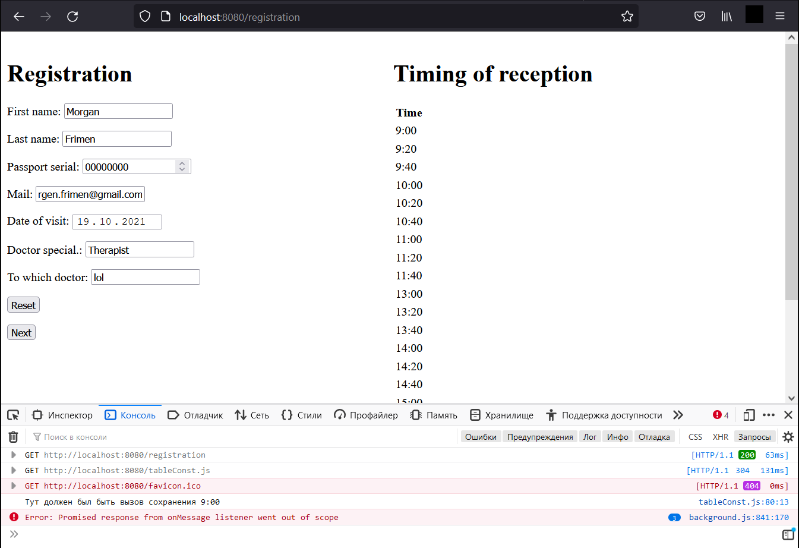
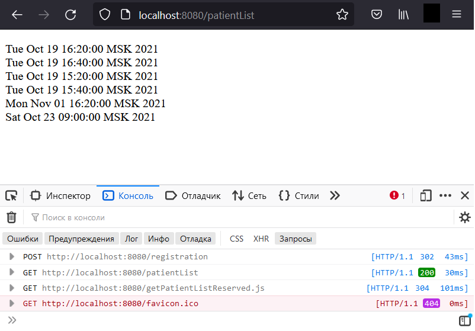

# Проект по созданию системы самозаписи в медицинскую клинику
_____________________________________________________________
### 2. Creating a repository with reserved data
	Создание системы и методов хранения дат записей в трехмерном массиве расценена как не перспективная.
	Создается репозиторий где будут храниться зарезервированные данные.
	
	Порядок действий примерно такой: 
	1) На сервер  посылается запрос на регистрацию http://localhost:8080/registration
	2) Запрос обрабатывает контроллер patientFrom(), он вызывает форму регистрации page.html
	3) На данный момент валидация присутствует только в поле "Date of visit" это поле обезательно для заполнения
	4) Нажимая "Next" вызывается JavaScript "tableConst" 
	5) Из скрипта делаем запрос с контроллеру http://localhost:8080/getRecord/ этот запрос будет обработан testGetRecord
	Смысл в том что в данный контроллер пердается дата (в формате "yyyy-MM-dd" и это String) контроллер вызывает из репозитория
	метод getRecord. Данный метод перебирает сохраненные в нем даты (зарезервированные даты/часы приема) перебор идет по трем
	параметрам год, месяц, день. Познее планирую улутшить данныей метод.
	6) Получив список (а получаем мы список строк который будет приводится к формату Date) в tableConst.js вызывается getTableHtml
	в данном методе создается таблица в которой буду указанны значения на которые можно оставить заявку и reserved. 
	В цикле происходит сравнение времени из полученных записей и "просто" доступного времени в данный день.
	Поскольку когда запрашивался список зарезервированых записей то сравнения проходили по год-месяц-день из репозитория гарантированно
	получены записи (зарезервированное время) только на конкретный день. Из данных дат (после приведения типов) извлекается 
	час + минуты и сравнивается с расписанием, если совпадение то вместо времени на которое можно записаться ставим запись reserved.
	Если совпадения не произошло то размещаем в теге возможность вызова метода который должен передать значение из себя (это время 
	например 16:20) в месте с датой в форму.
	7) Вызывается функция "oneClick" которая заполняет последнее поле в форме (html) для класса PatientForm.
	8) Если поле даты не пустое то происходит сохранение даты в репозитории. По скольку на данном этапе БД еще не используетя то 
	действие по созданию пользователя и сохранение его в бд схематично отображено в коментариях в коде.
	9) При удачном завершении всех этапов отобразится страница где будут отображены все зарезервированные записи.
	




### 1. Stage one
	Постановка задачи.
	Написать систему самозаписи в медицинскую клинику. Пациенты записываются на прием к врачам (познее добавить запись на исследования). У врачей будет 
	имется расписание когда они дежурят, врачи имеют разную специализацию. В данной реализации будут присутствовать по 4 врача, на каждую из 3 специализаций.
	Есть конкретный врач, либо общее расписаниеие (для записи на ближайшее число, врач по выбранной специальности ближайший свободный). Талон высылается
	на почту.
	В расписании будут использоватся фиксированное время. Нельзя будет записать двух человек на одно и то же время. В день на каждлго врача может быть 
	записанно не более 20 пациентов. Врачи работают с 9 до 17 часов следовательно (если вычесть час на обед) на каждого пациента выделяется по 20 минут. 
	Предварительно в БД (Регистрация в мед.клинику) будет содержатся три таблицы "Пациент", "Врач", "Расписание".
```sql
	CREATE TABLE patient
	(
	Id PRIMARY KEY,
	First_name VARCHAR(128) NOT NULL,
	Last_name VARCHAR(128) NOT NULL,
	Passport_serial INTEGER NOT NULL,
	Mail VARCHAR(255) NOT NULL,
	Date_of_visit DATE NOT NULL,
	To_which_dotor VARCHAR(128),
	Doctor_specialization VARCHAR(128) NOT NULL
	);

	CREATE TABLE doctor
	(
	Id PRIMARY KEY,
	Last_name VARCHAR(128) NOT NULL,
	First_name VARCHAR(128) NOT NULL,
	Specialization VARCHAR(128) NOT NULL,
	FOREIGN KEY (Id_doctor) REFERENCES timetable (Id_doctor)
	);

	CREATE TABLE timetable
	(
	Id PRIMARY KEY,
	Patient_id,				
	Doctor_id BIGINT NOT NULL,
	Date DATE NOT NULL,
	FOREIGN KEY (Patient_id) REFERENCES patient (Id),
	FOREIGN KEY (Doctor_id) REFERENCES doctor (Id)
	);
	
	CREATE TABLE disease_history
	(
	Id PRIMARY KEY,
	Patient_id BIGINT NOT NULL,
	Doctor_id BIGINT NOT NULL,
	Diagnosis TEXT,
	Recommendations TEXT,
	FOREIGN KEY (patient_id) REFERENCES patient (Id),
	FOREIGN KEY (doctor_id) REFERENCES doctor (Id)
	);
```


#### Questions and comments 
	Как пациент увидит какое время доступно для записи у конкретного врача?
	
	Создание терехмерного массива со значениями тру фолз (запись совершена / запиь свободна)
	этот массив должен быть сериализован, чтобы если сервер упадет, данные о произведенных записях не нужно было 
	считывать с бд. Касательно структуры данных будет лутше использовть массив с вложенными масивами.
	На каждый день расписание фиксированно как следствие создаем форму в которой указываем только время с 9:00 до 
	17:00 ссылки в этой форме обозначают структуру дня в котором есть свободное/занятое время.
	
	В сутках (двумерный массив) хранится массив с "интервалами для приема" которые длятся по 20 минут. И того за 
	один день таких интервалов (приемов пациентов) будет всего 20. следовательно всего 20 ячеек в массиве где
	хранится одно значение true или false что обозначает записался уже ктонибуть в этот день (true - записан, 
	false - свободно) на данный интервал либо нет.
	Трехмерный массив:
	boolean [месяц][день][интервалы времени для записи];
	Всего месецев 12. Так же должно быть созданна дополнителое решение для високосного года.
	
	месяца:
	[0] месяц Январь
	[1] месяц Февраль
	[2] месяц Март
	...
	[11] месяц Декабрь
	
	дни:
	[месяц n][0] день 1, n-ого месяца
	[месяц n][1] день 2, n-ого месяца
	[месяц n][2] день 3, n-ого месяца
	...
	[месяц n][30] день 31, n-ого месяца
	
	время будет поделенно примеро так:
	[месяц n][день n][0] время с 9:00 до 9:20, n-ого дня, n-ого месяца
	[месяц n][день n][1] время с 9:20 до 9:40, n-ого дня, n-ого месяца
	[месяц n][день n][2] время с 9:40 до 10:00, n-ого дня, n-ого месяца
	[месяц n][день n][3] время с 10:00 до 10:20, n-ого дня, n-ого месяца
	...
	[месяц n][день n][19] время с 16:20 до 16:40, n-ого дня, n-ого месяца
	
	boolean[][][] timetableDay;   //например октябрь запись на 4 число на 10:20 - 10:40
								  //цифра 9 обозначает октябрь т.к. нумерация в массиве начинается с 0
	dayAndTime[9][3][4] = false;  //свободно, тогда записываем
	dayAndTime[9][3][4] = true;   //это время занято, записатся на это время нельзя
	
	Добавление таблицы в которую будет записыватся диагноз и рекомендации по лечению
```sql
	CREATE TABLE disease_history
	(
	Id PRIMARY KEY,
	Patient_id BIGINT NOT NULL,
	Doctor_id BIGINT NOT NULL,
	Diagnosis TEXT,
	Recommendations TEXT,
	FOREIGN KEY (patient_id) REFERENCES patient (Id),
	FOREIGN KEY (doctor_id) REFERENCES doctor (Id)
	);
```	